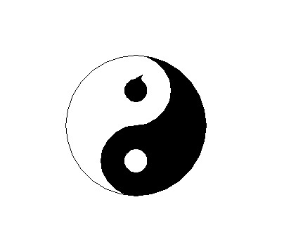

# Python-Turtle

1.Rainbow 
Creating a Rainbow Using Python in built function i.e Turtle
 

2.YinYang
Yinyang describes the two complementary forces—yin and yang—that make up all aspects and phenomena of life.
 

